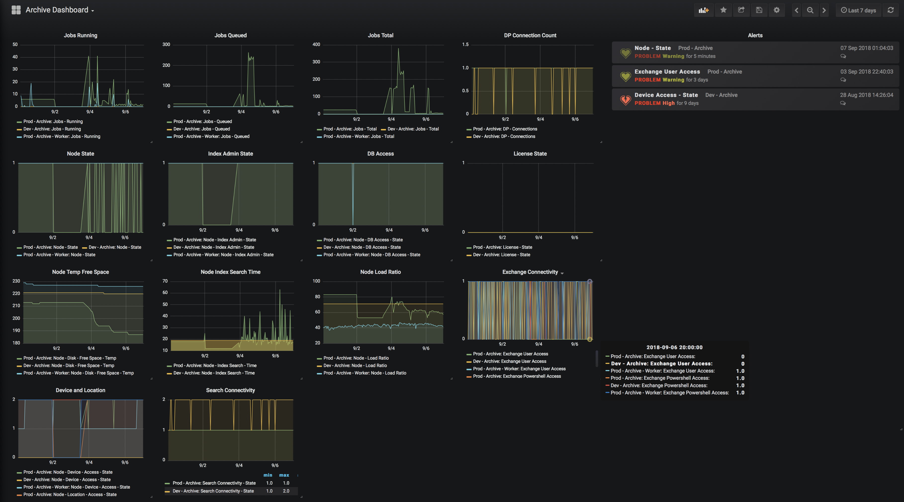
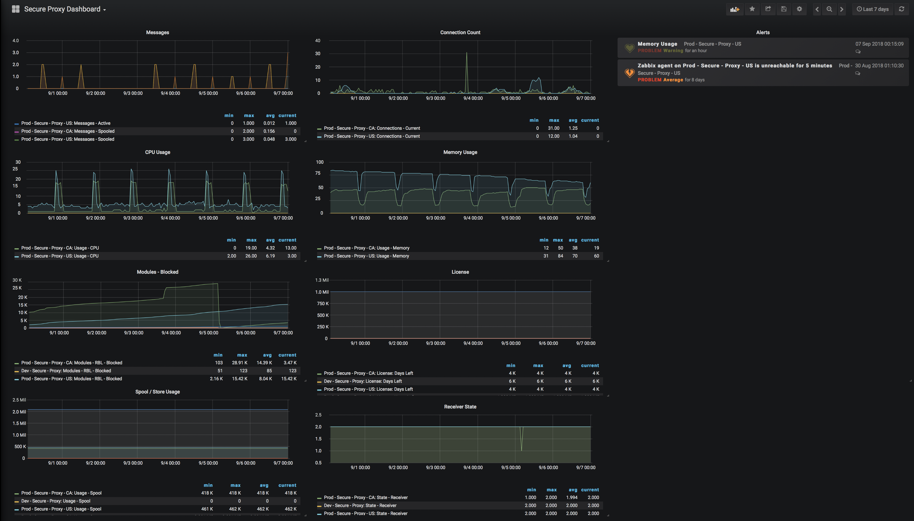

# Netgovern SNMP Platform Monitoring
While MIBs are available and are rich in information, sometimes a real-world suggestion for what to monitor, and what it means is required.  Below is a list of the most relevant items, their meaning and interpretations and example graphs that can be generated from them.

Please note that baselines vary from system to system, and should be adjusted to fit each particular environment.

## Archive:
### Mail store connectivity:

These counters reflect the system's ability to connect to the mail store. This affects it's ability to run jobs that work on items in your mail system, like archiving. These are binary values, with zero being bad, and one being good.

OID | Counter | Value
---|---| ---
1.3.6.1.4.1.27912.1.1.4.6 |  Exchange Powershell Access | 0\|1
1.3.6.1.4.1.27912.1.1.4.4 | Exchange User Access | 0\|1

### Node States:

These counters reflect the systems health as a whole.
* License state is a binary value with zero being good, and one being bad.
* For identification purposes, the node type reflects wether this is a worker or a master.
* The node state counter is a binary value with zero being bad, and one being good. A zero value usually means the netmail service is not running.
* The database connectivity counter is a binary value with zero being bad, and one being good. A bad value here will prevent log and job report access, and means the software cannot reach the database using the defined DSN.
* Load ratio reflects the system's business from the software's perspective. On a master node that has workers, this should be very low, on a worker, the desired value is high, to get the most of the compute resources on that node.

OID | Counter | Value
---|---| ---:
1.3.6.1.4.1.27912.1.1.7.2 | License - State | 0\|1
1.3.6.1.4.1.27912.1.1.1.3 | Netmail Archive Node Type | String
1.3.6.1.4.1.27912.1.1.1.4 | Node - State | 0\|1
1.3.6.1.4.1.27912.1.1.1.14 | Node - DB Access - State | 0\|1
1.3.6.1.4.1.27912.1.1.1.17 | Node - Load Ratio | Percentage

### Job Counters:

These counters show the count of jobs either running or queued, a well as a total, per node. The values here are less important than the trends. Job counts spike as jobs start, and gradually go down to zero. This cycle should repeat predictably. An erratic, or flat, pattern is worth investigating.

OID | Counter | Value
---|---| ---:
1.3.6.1.4.1.27912.1.1.1.6 | Jobs - Queued | int
1.3.6.1.4.1.27912.1.1.1.7 | Jobs - Running | int
1.3.6.1.4.1.27912.1.1.1.8 | Jobs - Total | int

### Storage States:

Most jobs write to disk in some way. These counters represent the system's access to defined locations and devices. They are trinary values, with zero meaning that all are down, one meanine some are down, and two meaning all are up. If all are down, the problem might be systemic, if only some are down, the problem might be localized.
The system relies on temp space for most data moves, as such, there needs to be enough temp space to accomodate the total need per move job.

OID | Counter | Value
---|---| ---:
1.3.6.1.4.1.27912.1.1.1.24 | Node - Device - Access - State | 0|1|2
1.3.6.1.4.1.27912.1.1.1.23 | Node - Location - Access - State | 0|1|2
1.3.6.1.4.1.27912.1.1.1.11 | Node - Disk - Free Space - Temp | Used space in GB

### Search Access:

Users interact with the software through the Search interface. Their initial perception is greatly affected by responsiveness, followed by the sucessful ability to see the requested data.  
These counters reflect both connectivity and timing to the indexing services responsible for handling these queries.  
The index search states are trinary values, with zero meaning that all index services are down, one meaning some are down, and two meaning all are up. The admin counter represents the interface used by jobs while the search counter represents the user facing interface.  
Index search timings of under 300ms feel responsive to users.  
The connection counter represents the current number of user connections across the search interface.

OID | Counter | Value
---|---| ---:
1.3.6.1.4.1.27912.1.1.1.19 | Node - Index Admin - State | 0\|1\|2
1.3.6.1.4.1.27912.1.1.1.20 | Node - Index Search - State | 0\|1\|2
1.3.6.1.4.1.27912.1.1.1.21 | Node - Index Search - Time | milliseconds
1.3.6.1.4.1.27912.1.1.5.16 | Search Connectivity - State | 0\|1\|2
1.3.6.1.4.1.27912.1.1.5.20.1.3.1 | DP - Connections | Count

---

## Secure:

### SMTP Modules:

These counters start at zero and go up throughout the uptime of the software. The trends need to be monitored as indicators of unusual activity or, should the slope be flat, for configuration issues, usually in DNS.  
These are only relevant on systems that receive SMTP traffic.

OID | Counter | Value
---|---| ---:
1.3.6.1.4.1.27912.1.2.2.6.0 | Modules - RBL - Blocked | Count
1.3.6.1.4.1.27912.1.2.3.6.0 | Modules - RDNS - Blocked | Count
1.3.6.1.4.1.27912.1.2.4.6.0 | Modules - Lists - Blocked | Count
1.3.6.1.4.1.27912.1.2.5.6.0 | Modules - Limits - Blocked | Count
1.3.6.1.4.1.27912.1.2.5.4.0 | Modules - Limits - Warn | Count
1.3.6.1.4.1.27912.1.2.7.6.0 | Modules - Greylist - Block | Count
1.3.6.1.4.1.27912.1.2.7.4.0 | Modules - Greylist - Warn | Count
1.3.6.1.4.1.27912.1.2.8.6.0 | Modules - AntiMasking - Blocked | Count
1.3.6.1.4.1.27912.1.2.9.6.0 | Modules - Protocol Filter - Blocked | Count
1.3.6.1.4.1.27912.1.2.10.6.0 | Modules - DBL - Blocked | Count

### Message processing agents:

Default max value is 50, this value should spike up and return to low single digits regularly.  
These are only relevant on systems that process message content.

**Active**: Currently being worked on  
**Queued**: Picked up from disk and in queue to take active slots  
**Spooled**: On disk waiting to be queued  

OID | Counter | Value
---|---| ---:
1.3.6.1.4.1.27912.1.2.12.6.0 | Agents - AV - Active | Count
1.3.6.1.4.1.27912.1.2.12.5.0 | Agents - AV - Queued | Count
1.3.6.1.4.1.27912.1.2.12.4.0 | Agents - AV - Spooled | Count
1.3.6.1.4.1.27912.1.2.13.6.0 | Agents - AB - Active | Count
1.3.6.1.4.1.27912.1.2.13.5.0 | Agents - AB - Queued | Count
1.3.6.1.4.1.27912.1.2.13.4.0 | Agents - AB - Spooled | Count
1.3.6.1.4.1.27912.1.2.14.6.0 | Agents - AS - Active | Count
1.3.6.1.4.1.27912.1.2.14.5.0 | Agents - AS - Queued | Count
1.3.6.1.4.1.27912.1.2.14.4.0 | Agents - AS - Spooled | Count
1.3.6.1.4.1.27912.1.2.15.6.0 | Agents - CF - Active | Count
1.3.6.1.4.1.27912.1.2.15.5.0 | Agents - CF - Queued | Count
1.3.6.1.4.1.27912.1.2.15.4.0 | Agents - CF - Spooled | Count
1.3.6.1.4.1.27912.1.2.16.6.0 | Agents - URI - Active | Count
1.3.6.1.4.1.27912.1.2.16.5.0 | Agents - URI - Queued | Count
1.3.6.1.4.1.27912.1.2.16.4.0 | Agents - URI - Spooled | Count
1.3.6.1.4.1.27912.1.2.17.6.0 | Agents - Delivery - Active | Count
1.3.6.1.4.1.27912.1.2.17.5.0 | Agents - Delivery - Queued | Count
1.3.6.1.4.1.27912.1.2.17.4.0 | Agents - Delivery - Spooled | Count

### Queue Agent:

One of the most variable baselines in the software, high numbers here are usually unhealthy, and can reflect deliverability issues, or simply bad user behaviour, or again issues at destination.

Active: Currently being worked on
Queued: Picked up from disk and in queue to take active slots
Spooled: On disk waiting to be queued
Delayed: Messages on disk in DSN cycles

OID | Counter | Value
---|---| ---:
1.3.6.1.4.1.27912.1.2.1.15.0 | Messages - Active | Count
1.3.6.1.4.1.27912.1.2.1.14.0 | Messages - Queued | Count
1.3.6.1.4.1.27912.1.2.1.16.0 | Messages - Spooled | Count
1.3.6.1.4.1.27912.1.2.1.17.0 | Messages - Delayed | Count

### SMTP Agent:

This reflects the number of current incoming SMTP connections. Since SMTP connections aim to be quick, this number will vary greatly, but will always want to be low. A high number here usually reflects problems in DNS.

OID | Counter | Value
---|---| ---:
1.3.6.1.4.1.27912.1.2.1.31.0 | Connections - Current | Count

### System States:

CPU usage should be highly variable but the average over a long enough period should rarely be over 50%, anything higher is alarming, and at 75% mail flow begins to be impacted.  
Memory usage should start low and climb to a plateau where it will stay, with some variation, for the entire uptime of the software. Should there be a consistent upward slope, this could be an indication of memory leaking.  
Spool disk usage should be steady, any rise should correlate with a rise in spooled, queued, delayed messages. Running out of space on the spool volume will force the SMTP agent to deliver messages through other nodes in the cluster, if possible, to prevent interuption.  
Store disk usage should be steady, any rise here should correlate with an uptick in incoming junk. Running ouf of space on the store volume will make the delivery agent leave messages destined for Quarantine in the spool, consuming message delivery retry cycles and taking them away from legitimate deliveries.  
Receiver state is a binary value where if it's not 1, then the system is not healthy and decided to close port 25. This is a bad thing.

OID | Counter | Value
---|---| ---:
1.3.6.1.4.1.27912.1.2.1.5.0 | Usage - CPU | Percentage
1.3.6.1.4.1.27912.1.2.1.6.0 | Usage - Memory | Percentage
1.3.6.1.4.1.27912.1.2.1.7.0 | Usage - Spool | Spool Usage in GB
1.3.6.1.4.1.27912.1.2.1.8.0 | Usage - Store | Store Usage in GB
1.3.6.1.4.1.27912.1.2.1.9.0 | State - Receiver | 0|1

### License stats:

Systems are licensed with both an expiration date and a license count. When either of those hit zero, bad things start to happen. Monitor these to make sure they do not get to zero.

OID | Counter | Value
---|---| ---:
1.3.6.1.4.1.27912.1.2.100.1.2.0 | License: Days Left | Count
1.3.6.1.4.1.27912.1.2.100.1.3.0 | License: Users Left | Count

## Template files, examples
The following Zabbix template files are provided as an example of how the SNMP counters could be used:
* [archive_master_template](./archive_master_template.xml)
* [archive_worker_template](./archive_worker_template.xml)
* [secure_proxy_template](./secure_proxy_template.xml)
* [secure_tenant_template](./secure_tenant_template.xml)

## Example dashboards

