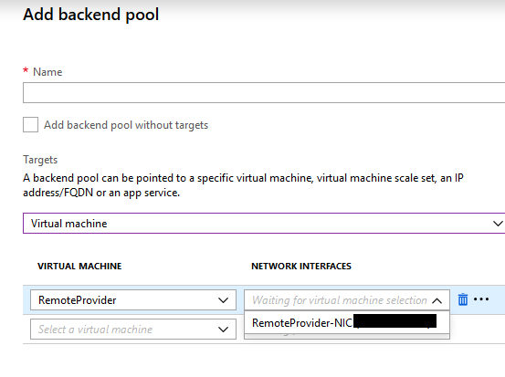

# Azure Application Gateway
This README covers how to deploy an Azure Application Gateway to be used as a frontend gateway for NetGovern Search instances

## Requirements:

* An empty subnet that will be used only by the App. Gateway
* A PFX certificate for SSL terminations


## Deployment:

1. From the Portal, Click on "Create a resource" and type Application Gateway.  


2. Complete the Basic Settings  


3. Choose or create new Virtual Networks and/or subnets  


4. Configure the listener and upload the certificate  


5. Review the summary and create the App. Gateway  


## Configuration:

1. Navigate to the resource pool where the App. Gateway was deployed and click on it to configure the backends:  


2. Click on "Backend Pools" --> "Add Backend Pool" and select the target VM.  It will be the Remote Provider VM from the pod's infrastructure layer:  


3. Go to "HTTP settings" --> Add.  This is where the destination port is configured (range starts at 8888 by default)  


4. Go to "Rules" --> "Add" in order to associate the backend pool and HTTP setting to the Frontend Listener:  


After completing these steps you'll be ready to point the DNS entry to the CNAME generated by Azure.  It can be obtained from:
Frontend IP configurations --> Your public IP address configuration.  


## Create Additional Listeners

In order to create additional Frontend listeners go to "Listeners" and then choose "Multi-site" to share the same IP (Additional IP addresses can be configured as well).
The following example shows how to add a Multisite Listener in order to reuse the same settings used at the first step (Deployment):  


After a new multisite is created, follow the previous steps at the "Configuration" section.

## Renew certificate

A certificate can be renewed following the below steps

1. If the certificate to use is not in a PFX format, convert it
2. Use the portal to update the certificate
or
3. Use AZ CLI / Powershell

## Convert a CRT cert to PFX

The following example uses a linux box to convert the certificate:
Using the openssl command:

```bash
openssl pkcs12 -export -out newcertificate.pfx -inkey private-key-file -in cert-file
```

newcertificate.pfx is the path to the new certificate that you will generate based on your private key and certificate.  (If you have a certificate with all the keys included, you have to put the same file name for both parameters)

Enter an export password when prompted:

```bash
Enter Export Password:
Verifying - Enter Export Password:
```

## Update the certificate using Azure Portal

1. Navigate to the resource pool where the App. Gateway was deployed and click on it.  Select Listeners and choose the listener with the certificate that needs renewal.  Expand the "Renew or edit selected certificate" and upload it


2. Click on Save and wait for the process to finish

## Update the certificate using AZ CLI

1. You need to have Azure CLI installed.  The following link covers the installation: https://docs.microsoft.com/en-us/cli/azure/install-azure-cli?view=azure-cli-latest and https://docs.microsoft.com/en-us/cli/azure/get-started-with-azure-cli?view=azure-cli-latest

2. run the following  to log in and make sure that you are using the correct subscription (verify `isDefault: true`)
    ```bash
    az login
    ```

3. Use the following command, replacing with your own info
    ```bash
    az network application-gateway ssl-cert update \
        -n "<CertName>" \
        --gateway-name "<AppGatewayName>" \
        -g "ResourceGroupName>" \
        --cert-file <PathToCerFile> \
        --cert-password '<password>'
    ```

4. When it finishes it outputs something like:
```json
{
  "data": null,
  "etag": "W/\"xxxxxxxx-xxxx-xxxx-xxxx-dxxxxxxxx\"",
  "id": "/subscriptions/xxxxxxx-xxxx-xxxx-xxxx-xxxxxxxxxxx/resourceGroups/production/providers/Microsoft.Network/applicationGateways/yourAppGateway/sslCertificates/yourcertname",
  "keyVaultSecretId": null,
  "name": "yourcertname",
  "password": null,
  "provisioningState": "Succeeded",
  "publicCertData": "EDITEDxxxxxxxxxxxxxxxxxxxxxxxxxxxxxxxxxxxxxxxxxxxxxxxxxxxxxxxxxxxxxxxxxxxxxxxxxxxxxxxxxxxxxxxxxxxxxxxxxxxxxxxxxxxxxxxxxxxxxxxxxxxxxxxxxxxxxxxxxxxxxxxxxxxxxxxxxxxxxxxxxxxxxxxxxxxxxxxxxxxxxxxxxxxxxxxxxxxxxxxxxxxxxxxxxxxxxxxxxxxxxxxxxxxxxxxxxxxxxxxxxxxxxxxxxxxxxxxxxxxxxxxxxxxxxxxxxxxxxxxxxxxxxxxxxxxxxxxxxxxxxxxxxxxxxxxxxxxxxxxxxxxxxxxxxxxxxxxxxxxxxxxxxxxxxxxxxxxxxxxxxxxxxxxxxxxxxxxxxxxxxxxxxxxxxxxxxxxxxxxxxxxxxxxxxxxxxxxxxxxxxxxxxxxxxxxxxxxxxxxxxxxxxxxxxxxxxxxxxxxxxxxxxxxxxxxxxxxxxxxxxxxxxxxxxxxxxxxxxxxxxxxxxxxxxxxxxxxxxxxxxxxxxxxxxxxxxxxxxxxxxxxxxxxxxxxxxxxxxxxxxxxxxxxxxxxxxxxxxxxxxxxxxxxxxxxxxxxxxxxxxxxxxxxxxxxxxxxxxxxxxxxxxxxxxxxxxxxx",
  "resourceGroup": "YourResourceGroup",
  "type": "Microsoft.Network/applicationGateways/sslCertificates"
}
```