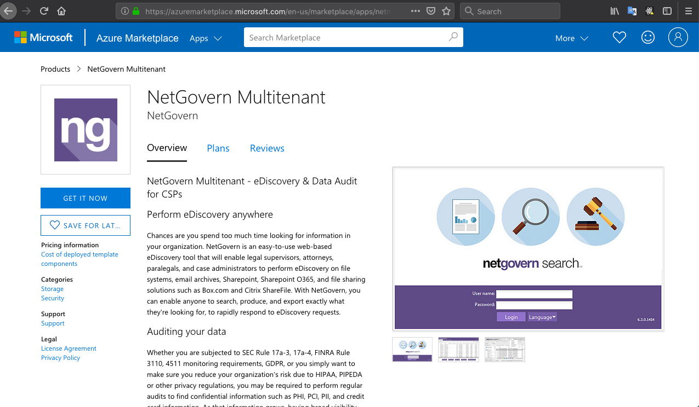
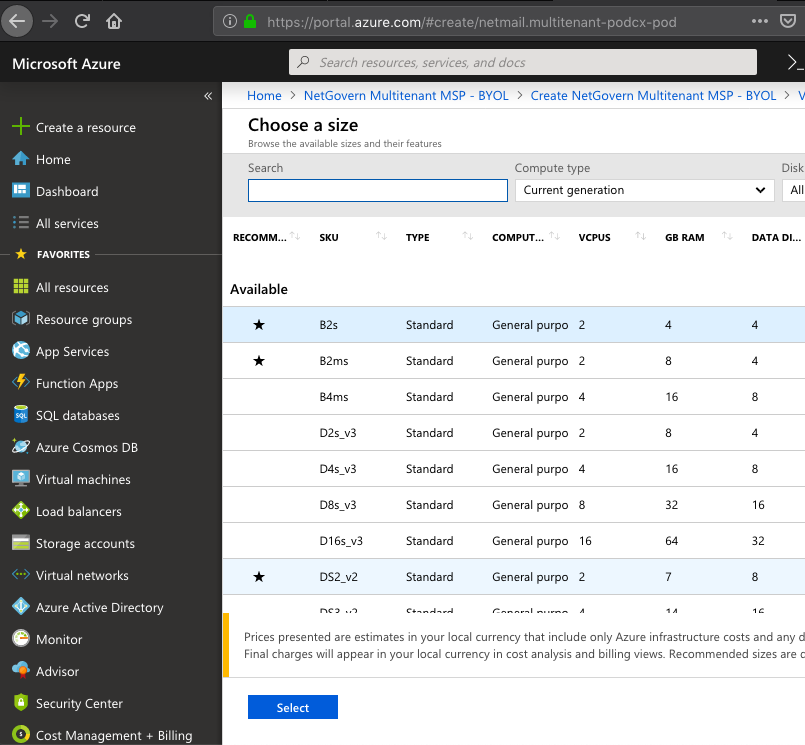

# NetGovern Pod deployment - Azure Marketplace
How to deploy a Pod using a NetGovern solution template

## Azure Marketplace

1. Go to [Azure Marketplace URL](https://azuremarketplace.microsoft.com)
  

2. Search for NetGovern in the search bar and select the MultiTenant Solution:
  

3. Click on "Get it Now"
  

4. Fill in the required contact info:
  

5. You will be directed to Microsoft's Azure Portal.  Click on Create:
  

6. The first step is to configure basic settings:  
    * An admin account and password that will be used for all of the VMs deployed within this solution template
    * The Azure subscription to be used
    * A new or empty resource group
    * The location
      

7. In the second step, the network has to be defined.  It can be an existing network or you can create a new one:
  

8. Step 3 is used to define the VM sizes and the OS disk type chosen for each of the shared layer VMs that will be part of the pod:
  
  
  

9. In the next step, the first tenant Master server settings have to be entered:
  

10. Step 5 is to validate the settings entered before:
  

11. And we finally click on "Create":
  

12. A Template Deployment will be launched, which can be followed from the same portal session:

  

13. NetGovern Pod ready to use!
